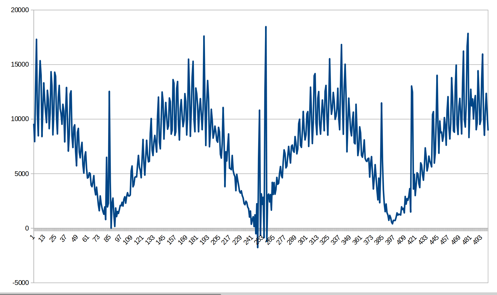
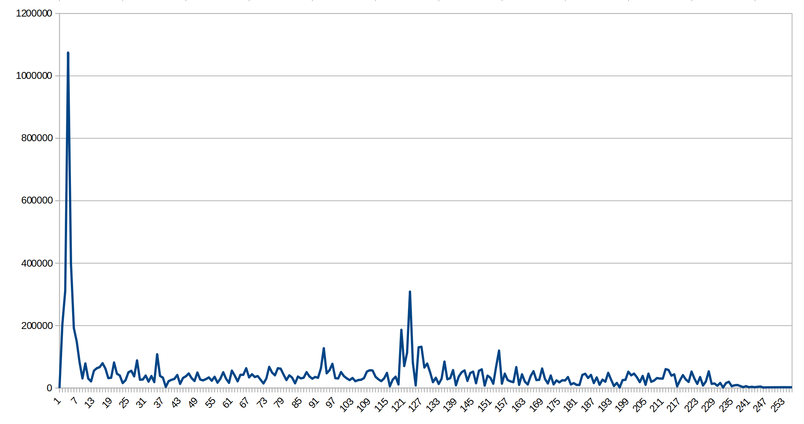
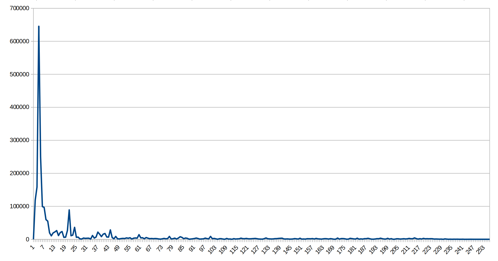

# Algorithms description

## Intro

This project is alternative of [Grinder speed control with stable RPM](https://github.com/speedcontrols/ac_sc_grinder), using current pulses to measure speed,
instead of BackEMF.

**Pros:**

- Direct RPM measure (causes better regulator response).
- More simple schematic (no need to measure voltage).
- Support both AC and DC brushed motors.
- Easy to rework for low voltage (battery powered motors).

**Cons:**

- Minimal measured frequency is 500 Hz, if powered with rectified voltage
  (3750 RPM for 8-pole motors).
- Not all motors can be powered with rectified voltage.

Good news is, all grinders have minimal speed > 4500 RPM (600 Hz)

## Speed calculation

Idea is simple - use FFT and find peak frequency. Also, we have to drop noise,
produced by rectified power:

- 100/120 Hz (depends on country)
- harmonics up to 4 (up to 480 HZ)

Ordinary grinders have 8-pole motors and work in range 5000...30000 RPM. Some
models - up to 45000 RPM. Desired range to measure is 670...6000 Hz.

Let's see images for real signals.

- 16Khz sampling rate.
- 512 points FFT (32Hz per point)
- zeroed first FFT point for better scale

Current at high speed:

Current at low speed:

Spectre at high speed:

Spectre at low speed:

In worst case (4500 RPM), precision is 32/600 => 5%. Good enough for real world.

If better precision required - we can use 1024 points FFT, or FIR-decimator to
downsample signal at low speeds. That depends on available MCU memory (RAM)
and speed.

## Autocalibration

### Limits calibration

Since speed detector as affected by rectified power noise at very low speeds,
we need some cut-off barriers.

1. Set power to max and remember max possible RPM (required for proper
   speed knob work).
2. Relax ADRC params, set speed to minimal possible and:
   - Measure average energy at min speed and set cut-off barrier to 50-70%.
   - Measure motor voltage, and never set it below 90% of value.

### ADRC-control and calibration

Grinder motors are very inconvenient for PID-based systems:

- RPM/Volts response is non linear, and varies significantly between different
  grinder models. The same about zero speed offset.
- Cooling fan adds extra distortion.

So, we use ADRC instead of PID. Adaptive character of the ADRC system makes it
possible to use without the RPM/Volts response linearization. Deviations from
the linear RPM/Volts response are eliminated by the generalized disturbance
observer (they are part of the generalized disturbance).

First-order ADRC system consists of linear proportional controller with `Kp` gain
and 2 state observers - speed observer, generalized disturbance observer.
Observers are integrators with `Kobservers` gain and `L1`, `L2` time constants.
Output of the linear proportional controller is corrected by generalized
disturbance signal. This correction eliminates (in the steady state) the motor
speed deviation caused by mechanical motor load, motor parameters deviation,
inaccurate motor parameters estimation.

ADRC system parameters and equations:

`b0` = `K / T`, where `K=1` due to speed and triac setpoint normalization,
`T` - desired optimal motor time constant.

`L1` - time constant of the speed observer.

`L2` - time constant of the generalized disturbance observer.

`u0` - output of linear proportional controller in ADRC system.

Speed observer equation:

Generalized disturbance observer equation:

`P_correction` - proportional correction signal, makes reaction to motor load change significantly faster.

Output signal of ADRC regulator:

General steps of ADRC calibration are:

1. Measure motor start/stop time. Then use it for understand max possible
   oscillations period.
2. Find `Kp` in range [0.3\*b0..0.3\*b0+4] by halving (division by 2) method.
   Criteria - "no oscillations" (speed dispersion should not exceed normal noise).
3. Find `Kobservers` in range [0..max] by halving method. Criteria -
   "no oscillations".
4. Find `P_corrcoeff` in range [0..max] by halving method. Criteria -
   "no oscillations".

**Implementation notes**

Basic start/stop time measure:

- We should select begin/end setpoints, where speed can be measured good enougth.
  Use 0.35 and 0.7.
- Common criteria of interval end is "when speed reach 2% window of desired
  setpoint". But signal is noisy, and we use simple trick: wait 15% window and
  multiply to `log(0.15)/log(0.02)` (because speed growth is ~ logarithmic).

Measure `Kp`:

- Set `Kobservers` to safe value (1.0), `Kp` min possible (0.3\*b0),
  `P_corrcoeff` to 0.0, measure all at minimal allowed speed.
- Wait for stable speed
- Measure noise amplitude, abs(max - min) for period ~ start/stop time.
- Use starting step = +4.0, and halving method. Check noise amplitude not exceed
  110% of initial value.
- Make 7 iterations total (last step will be 0.1 - good precision).
- Use 0.6 of final value as safe.

It would be better to count dispersion instead, but that's more complicated.
Counting min/max after median filter seems to work. Note, speed value is very
noisy. Applying some filter before min/max check is mandatory.

Measure `Kobservers`:

- Set `Kobservers` to 0.0, `Kp` to calibrated, `P_corrcoeff` to 0.0,
  measure all at minimal allowed speed.
- Wait for stable speed
- Measure noise amplitude, abs(max - min) for period ~ start/stop time.
- Use starting step = +4.0, and halving method. Check noise amplitude not exceed
  110% of initial value.
- Make 7 iterations total (last step will be 0.1 - good precision).
- Use 0.6 of final value as safe.

Measure `P_corrcoeff`:

- Set `Kobservers` to calibrated, `Kp` to calibrated, `P_corrcoeff` to 0.0,
  measure all at minimal allowed speed.
- Wait for stable speed
- Measure noise amplitude, abs(max - min) for period ~ start/stop time.
- Use starting step = +4.0, and halving method. Check noise amplitude not exceed
  110% of initial value.
- Make 7 iterations total (last step will be 0.1 - good precision).
- Use 0.6 of final value as safe.

# More to read

1. [A Simulative Study on Active Disturbance Rejection Control (ADRC) as a Control Tool for Practitioners - Gernot Herbst](https://arxiv.org/pdf/1908.04596.pdf).
2. [Grinder speed control with stable RPM](https://github.com/speedcontrols/ac_sc_grinder).
